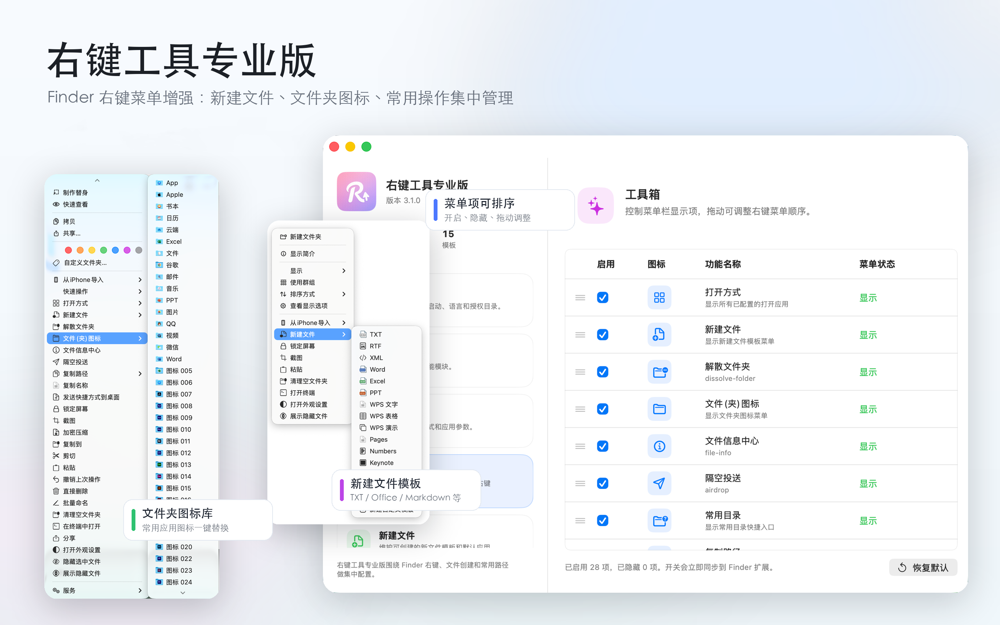

<div align="center">


# 超级右键专业版 · 右键工具 Pro

**RightClick Assistant Pro — 为 macOS Finder 打造的开源超级右键菜单增强工具**

又名：超级右键、超级右键专业版、超级右键助手、右键助手 Pro、RightMenu Pro

[](https://apps.apple.com/cn/app/rightmenupro-new-file-creator/id6777939731)
[](https://github.com/huzitonglover/RightClickAssistantPro/actions/workflows/build.yml)


[](LICENSE)

简体中文 | [English](#english)

</div>



## ✨ 功能

在 Finder 中右键即可使用：

| 分类 | 功能 |
| --- | --- |
| 📄 新建 | 新建 Word / Excel / PPT / Pages / Numbers / Keynote / WPS / Markdown / TXT / RTF / PSD / AI 等文件 |
| 🎨 外观 | 更换文件夹图标、隐藏 / 显示隐藏文件、外观设置 |
| 📋 复制 | 复制路径、复制文件名、复制到、移动到、剪切、粘贴 |
| 🗂 整理 | 批量重命名、清理空文件夹、解散文件夹、直接删除、撤销操作 |
| 🗜 压缩 | 加密压缩 ZIP、解压 ZIP（支持带密码的压缩包） |
| 🛠 工具 | 常用打开方式、常用目录、终端打开、文件信息、识别二维码、图片文字提取、截图、隔空投送、发送快捷方式到桌面、锁定屏幕 |

<p>


</p>

## 📦 安装

**推荐：** 从 [Mac App Store](https://apps.apple.com/cn/app/rightmenupro-new-file-creator/id6777939731) 安装，一键安装、自动更新，也是对作者最直接的支持 ❤️

安装后请在 **系统设置 → 通用 → 登录项与扩展 → 访达扩展** 中启用 `AssistantFinderExtension`。

## 🔨 从源码编译

环境要求：Xcode 16+，macOS 12.0+

```bash
git clone https://github.com/huzitonglover/RightClickAssistantPro.git
cd RightClickAssistantPro
open RightClickAssistantPro.xcodeproj
```

1. 在 Xcode 中分别选中 `RightClickAssistantPro` 和 `AssistantFinderExtension` 两个 Target，在 **Signing & Capabilities** 中把 Team 改成你自己的开发者账号。
2. 把 Bundle Identifier 和 App Group（`group.rightPro.touch.com`）改成你自己的，两个 Target 要保持一致。
3. 运行 `RightClickAssistantPro` Scheme。

仅验证能否编译（无需签名）：

```bash
xcodebuild -project RightClickAssistantPro.xcodeproj -scheme RightClickAssistantPro \
  -destination 'platform=macOS' CODE_SIGNING_ALLOWED=NO build
```

## 🧱 项目结构

```
RightClickAssistantPro/        主 App（设置界面、功能执行）
  App/Entry                    AppDelegate 与各类右键动作实现
  App/Features                 功能模块
  App/Settings                 设置界面
  Resources                    新建文件所用的空白模板
AssistantFinderExtension/      Finder Sync 扩展（构建右键菜单、分发动作）
scripts/                       打包与本地测试环境清理脚本
```

## 🤝 参与贡献

欢迎提交 Issue 和 Pull Request！提交 PR 前请确保项目可以正常编译。

## 📄 许可证

源代码基于 [GNU GPL v3.0](LICENSE) 开源。

「右键工具 Pro」「超级右键专业版」等名称及 App 图标归作者所有，不在开源许可范围内。基于本项目的衍生作品请使用不同的名称和图标。项目中出现的第三方品牌图标（如 QQ、微信、Google、Apple、Microsoft Office 等）的商标权归各自所有者，仅用于标识对应应用，不在本项目许可范围内。

## 🙏 致谢

- [ZIPFoundation](https://github.com/weichsel/ZIPFoundation)（MIT）
- [swift-collections](https://github.com/apple/swift-collections)（Apache-2.0）

---

<a name="english"></a>

## English

**RightClick Assistant Pro** (a.k.a. RightMenu Pro, 超级右键专业版) is an open-source Finder context-menu (right-click menu) enhancer for macOS.

**Features:** create new files from templates (Office, iWork, WPS, Markdown, PSD, AI…), change folder icons, copy path / file name, copy / move / cut / paste, batch rename, clean up empty folders, encrypted ZIP compression and extraction, open in Terminal, QR code recognition, image text extraction (OCR), screenshots, AirDrop, show / hide hidden files, lock screen, and more.

**Install:** get it from the [Mac App Store](https://apps.apple.com/cn/app/rightmenupro-new-file-creator/id6777939731), then enable `AssistantFinderExtension` in **System Settings → General → Login Items & Extensions → Finder Extensions**.

**Build from source:** open `RightClickAssistantPro.xcodeproj` in Xcode 16+, set your own Team, Bundle Identifiers and App Group for both targets, then run the `RightClickAssistantPro` scheme.

**License:** source code is licensed under [GPL-3.0](LICENSE). The app name and icon are not covered by the license; please rename and rebrand derivative works. Third-party brand icons remain the property of their respective owners.
